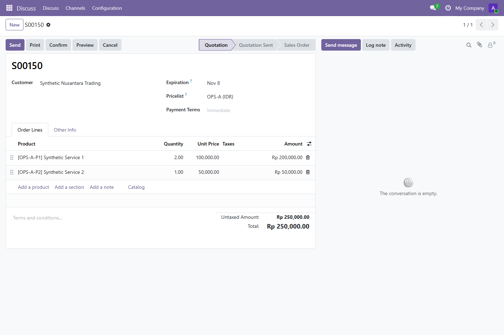
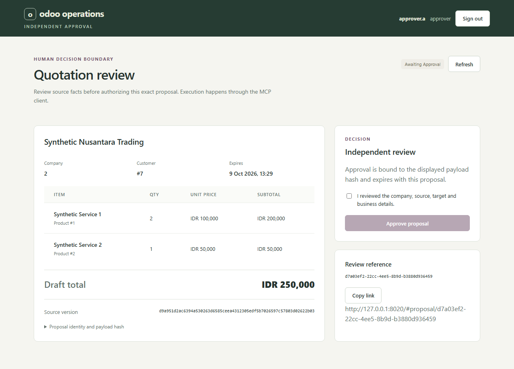
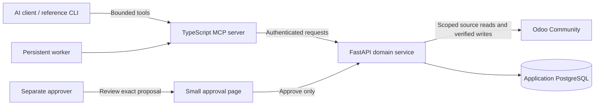

# Odoo Business Operations MCP Server

**An MCP client prepares a source-backed business action; a separate person approves it; the client executes through MCP and verifies the record in Odoo.** This repository demonstrates that complete boundary with synthetic local sales data, not a second sales application.



The connected example resolved customer `OPS-A-001` and two catalog products, prepared a **IDR 250,000** draft, received independent approval, and created Odoo quotation **S00150**. Odoo read-back matched the approved lines and total. A replay returned the original operation; the application ledger and Odoo order each contained **one** row for that operation. [Inspect the recorded journey](docs/evidence/mcp-first-journey.md).

## What MCP contributes

The server exposes eleven bounded tools through authenticated stdio. It gives an AI client useful business capabilities without granting arbitrary Odoo model or SQL access.

| Step | MCP tools | Boundary |
| --- | --- | --- |
| Read source | `odoo.identity`, `odoo.customer_search`, `odoo.catalog`, `odoo.opportunity_list`, `odoo.opportunity_get` | Company-scoped records and catalog prices |
| Prepare | `odoo.quote_prepare`, `odoo.activity_prepare`, `odoo.proposal_get` | Immutable proposal; no Odoo write |
| Human handoff | `odoo.review_status` | Returns approval ID after a separate person approves; cannot approve |
| Execute and verify | `odoo.execute_approved`, `odoo.operation_status` | Approved, idempotent write and authoritative Odoo read-back |

An MCP proposal ID opens `http://127.0.0.1:8020/#proposal/<proposal-id>` in the local approval page. The approver sees the company, target, items or activity, source version, payload hash and expiry. After approval, the operator calls `odoo.review_status` for the approval ID and `odoo.execute_approved` with a stable idempotency UUID. The browser contains no execution control.



See the [MCP contract](MCP-INTEGRATIONS.md), [approval-page guide](docs/WEB-UI.md), and [connected transcript](docs/evidence/mcp-first-journey.md) for exact inputs and results.

## Why the boundaries matter

Customer names can collide; prices can change between preview and write; a timeout can hide a successful write. The domain service resolves exact records and enforces tenant and role scope. Human approval binds to the proposal's payload hash. The Odoo addon checks source freshness at execution. A durable operation ID and idempotency key make replay and uncertain-outcome reconciliation safe. A draft quotation is not a confirmed sale or an emailed quotation.



The browser is solely the human decision surface. Odoo remains the source and result surface. The reference client and worker reuse the same four Python skills and domain rules. [Engineering case study](docs/portfolio/CASE_STUDY.md).

## Evidence and scope

| Checkpoint | Observed result | Evidence |
| --- | --- | --- |
| Current connected MCP/browser journey | Source lookup, preparation, separate approval, execution, status, replay and cross-company denial passed; one ledger row and one Odoo order | [Phase 9B journey](docs/evidence/mcp-first-journey.md) |
| Phase 9A browser checkpoint | 13 checks of the earlier full workspace | [Historical Phase 9A report](docs/PHASE-9A.md) |
| Phase 8 controls | 98 offline, 41 PostgreSQL/Odoo and 14 live checks | [Control record](docs/evidence/phase8-controls.txt) |
| Phase 8 workload | 124 tasks, including 31 verified drafts; 31/31 writes had one ledger and Odoo effect | [Reliability report](docs/PHASE-8.md) |
| Phase 8 recovery | 30.11-second isolated matching restore and authenticated read-back | [Recovery record](docs/evidence/phase8-recovery.json) |

These are distinct, partly overlapping suites and synthetic local data. They do not establish production or cloud performance. The historical Phase 9A tag retains its full workspace and evidence; this current version deliberately reduces the browser to approval.

## Run locally

Requirements: Docker with Linux containers, Python 3.13 and Node.js 22+. For credential-free checks:

```powershell
python -m venv .venv
.venv/Scripts/python.exe -m pip install -r backend/requirements.lock
npm ci --prefix client
npm ci --prefix mcp-server
.venv/Scripts/python.exe deploy/check_offline.py
```

For the synthetic Odoo stack and connected test, follow the [operator guide](docs/USER-GUIDE.md), then run `npm test --prefix tests/web`. The test prepares through MCP, approves in Chromium, executes through MCP, and saves private raw outputs under ignored `local/web-acceptance/`. It does not call a paid model.

[Learning checkpoints](docs/LEARNING-PATH.md) · [All documentation](docs/README.md) · [Security](SECURITY.md) · [Optional Azure plan](docs/AZURE-PLAN.md)
