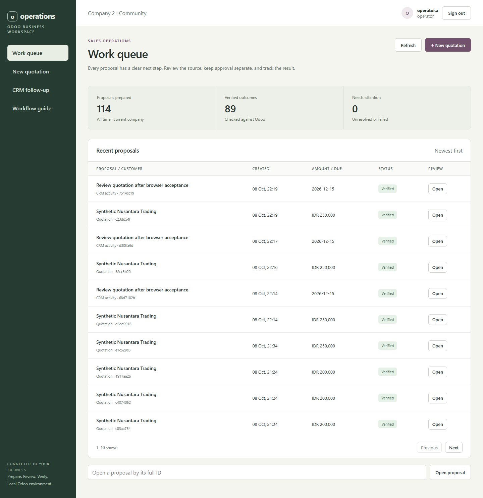
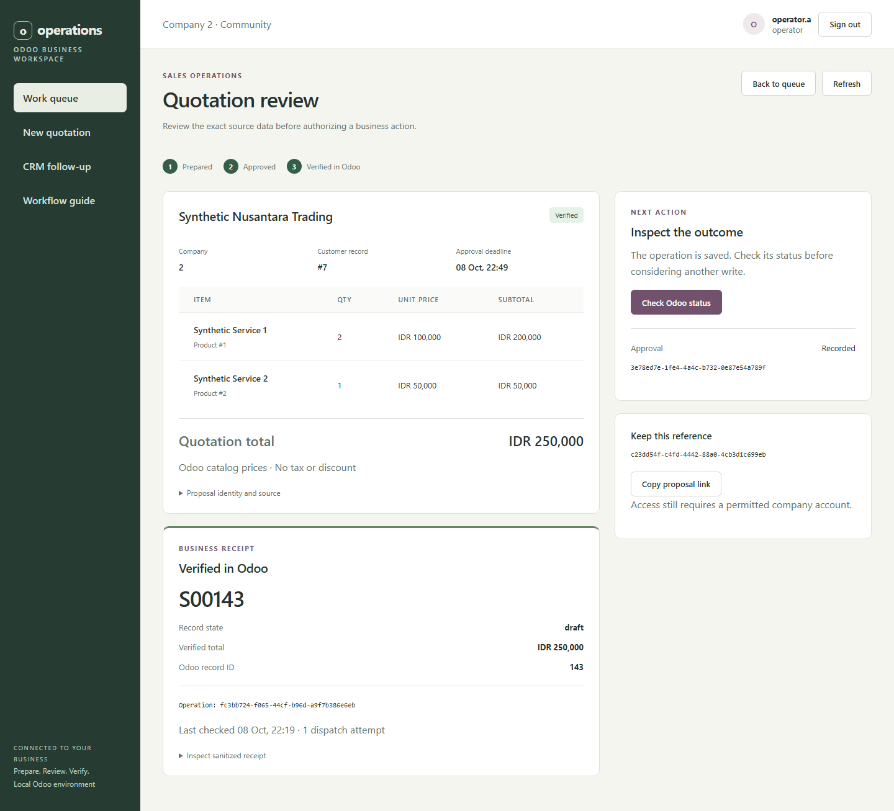
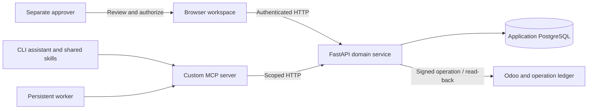

# Odoo Business Operations MCP Server

**AI-assisted sales operations with explicit approval and verified Odoo outcomes.**

Research customer records, prepare quotations and CRM activities, review the exact
proposal, and verify what Odoo actually created. A custom MCP server connects
bounded AI intent to authenticated business workflows.



**Browser workspace:** prepare quotations and CRM follow-ups, review approvals,
and inspect verified Odoo receipts. [Open locally](http://127.0.0.1:8020/) after
starting the stack, or follow the [web UI guide](docs/WEB-UI.md).

[Web UI tour](docs/WEB-UI.md) · [Engineering case study](docs/portfolio/CASE_STUDY.md) · [Operator guide](docs/USER-GUIDE.md) · [Documentation](docs/README.md)

## Why this project

A plausible AI response is not enough to create a business record. Customer names
can collide, product prices can change after a preview, and a network timeout can
hide a successful write. Retrying blindly can create a second quotation.

This project puts those operational problems inside the workflow: resolve the
source, bind approval to the proposal, execute with a durable operation ID, and
read the result back from Odoo before reporting success.

## Evidence at a glance

| Result | What was verified | Evidence |
| --- | --- | --- |
| **4 skills · 10 MCP tools** | Shared research, quotation, CRM activity and reconciliation workflows | [Skills](skills/README.md), [MCP server](docs/PHASE-4.md) |
| **13 browser checks passed** | Quotation and CRM workflow, separate approval, lost-response recovery and company isolation | [Browser acceptance](docs/PHASE-9A.md) |
| **153 Phase 8 checks passed** | 98 offline, 41 PostgreSQL/Odoo, 14 live checks at the reliability checkpoint | [Verification record](docs/evidence/phase8-controls.txt) |
| **124 workload tasks** | 93 correct reads and 31 verified drafts; zero errors or dropped tasks | [Reliability results](docs/PHASE-8.md) |
| **31 / 31 single effects** | Every load-run write had exactly one Odoo ledger entry and order, including replay | [Load evidence](docs/evidence/phase8-load.json) |
| **30.11 s restore** | Isolated matching database/filestore restore with authenticated business read-back | [Recovery evidence](docs/evidence/phase8-recovery.json) |

Results use synthetic local data. Browser acceptance belongs to Phase 9A; load
and recovery measurements belong to Phase 8. The latest workspace also passes
102 offline checks and a container suite with 132 passed / 20 optional skips.
These suites overlap and are reported separately. [Reproduce the workspace checks](docs/PHASE-9A.md).

## A quotation, from request to receipt

1. **Resolve** the exact customer and products within the caller's company.
2. **Prepare** an immutable preview with source version, line items and total.
3. **Review** with a separate approver; authorization is bound to the payload hash.
4. **Execute** using the approved proposal and a stable idempotency key.
5. **Verify** the actual Odoo record; reconcile uncertain outcomes before retrying.



The browser shows the exact proposal, independent approval and actual Odoo
receipt. [Explore the workspace](docs/WEB-UI.md), including CRM follow-ups and
recovery, or inspect the [recorded CLI workflow](docs/demo/README.md).
Natural-language assistant requests currently use the CLI.

## Architecture and authority



The browser and MCP clients share the same domain authorization and execution
rules. Odoo remains the source of business records.

| Layer | Responsibility |
| --- | --- |
| Browser workspace | Prepare, review and execute through the same authenticated domain API |
| AI assistant | Produce one bounded typed intent or request clarification |
| Custom MCP server | Expose allowlisted tools through authenticated stdio calls |
| FastAPI domain service | Enforce tenant/role scope, proposal freshness, approval and execution rules |
| Separate approver | Review and authorize the exact proposal version |
| Odoo + operation ledger | Apply the business action and provide read-back evidence |
| Persistent worker | Reuse skills with deduplication, leases and bounded recovery |

**Stack:** TypeScript MCP and reference client · Python/FastAPI · PostgreSQL ·
Odoo Community 19.0 / JSON-2 · SQLite orchestration journals · Docker Compose.
OpenAI is the tested hosted profile; Ollama is available for experimental
local-only use. [Model evaluation and scope](docs/PHASE-7.md).

## Try it locally

Requirements: Docker with Linux containers, Python 3.13 and Node.js 22+.
Start with credential-free checks from the repository root:

```powershell
python -m venv .venv
.venv/Scripts/python.exe -m pip install -r backend/requirements.lock
npm ci --prefix client
npm ci --prefix mcp-server
.venv/Scripts/python.exe deploy/check_offline.py
```

On Linux, use `.venv/bin/python`. This command builds the TypeScript packages
and runs the offline checks without Docker, provider keys or model inference.

For the full Odoo workflow, follow the [operator guide](docs/USER-GUIDE.md):
start the synthetic stack, prepare a quotation, approve with a separate account,
and inspect its verified receipt. The deterministic workflow needs no paid model.

## Explore the engineering

- [Case study](docs/portfolio/CASE_STUDY.md): architecture decisions, failure modes and measured outcomes.
- [Reliability report](docs/PHASE-8.md): workload definitions, percentiles, resources and recovery.
- [Local runbook](docs/LOCAL-RUNBOOK.md): uncertain writes, credentials, backup and rollback.
- [Learning checkpoints](docs/LEARNING-PATH.md): one commit per completed phase, preserved tags.
- [Azure proposal](docs/AZURE-PLAN.md): restricted demo design and cost assumptions; deployment pending.

**Delivery status:** browser workspace and local workflows validated. Azure
deployment is the next phase.
All documentation is indexed in [docs/README.md](docs/README.md).
