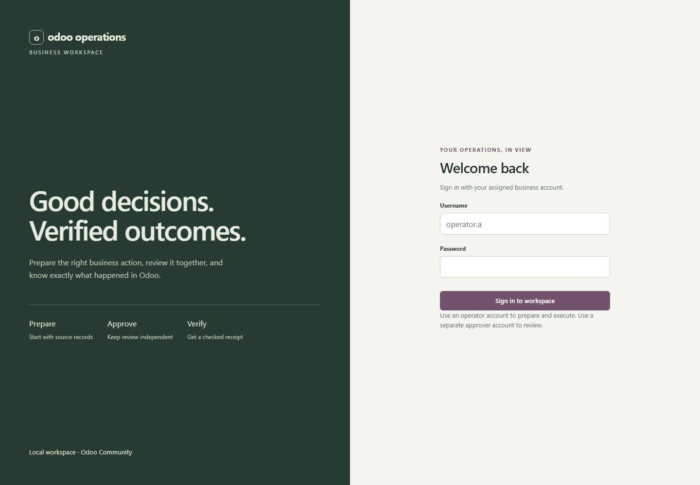

# Browser workspace

An English operational interface for quotation preparation, CRM follow-ups,
independent approval and verified Odoo receipts. It uses the same FastAPI domain
API as the reference clients. No extra frontend container, hosted font, CDN or
paid model call is required.


## Open locally

Use the `phase-9a-web-ui` checkpoint and the [installation guide](USER-GUIDE.md).
For an already configured local stack, rebuild only the API:

```powershell
docker compose -f compose.yaml -f compose.odoo.yaml -f compose.resources.yaml build api
docker compose -f compose.yaml -f compose.odoo.yaml -f compose.resources.yaml up -d --no-deps --wait api
```

Open [the workspace](http://127.0.0.1:8020/). Synthetic local accounts are
`operator.a`, `approver.a` and their `.b` equivalents for the other company.
Use `DEMO_PASSWORD` from your private `.env`; the UI does not embed it.
Existing sandbox records and volumes are retained. Never expose these shared
demo credentials to the public internet.



## Prepare, approve and verify

1. Sign in as the operator and choose **New quotation**. Search for the exact
   customer reference and explicitly select a record. Choose catalog products
   and positive integer quantities; select **Prepare quotation preview**.
2. Review the customer, company, line items, source prices and total. The
   proposal is saved, but no Odoo quotation exists yet. Copy its link or find
   it in the work queue.
3. Open a separate browser profile/private window and sign in as the approver,
   or sign out and sign in with the separate account. Open the proposal,
   review its details, check the confirmation and select **Approve proposal**.
4. Return to the original operator session and refresh the proposal. Check
   the explicit creation confirmation and choose **Create in Odoo**.
5. Inspect the **Verified in Odoo** receipt. It identifies the actual draft,
   total, operation and dispatch attempts. A draft is not a confirmed sale or
   an emailed quotation.


For **CRM follow-up**, choose an opportunity, confirm the suggested opportunity
owner or enter a valid company assignee, and supply the due date and summary.
The same independent approval and original-operator execution rules apply.

## Resume and handle errors

- The work queue is company-scoped, newest first, with ten rows per page.
  Company totals cover all stored operations; they are not model-quality metrics.
- Reloading clears the in-memory login. Sign in again and reopen the saved
  proposal; its approval and operation come from the server.
- If execution loses its HTTP response, the UI reloads the saved proposal to
  discover the operation. If connectivity remains unavailable, wait and refresh.
  The same execution key is retained for that actor/proposal in session storage.
- **Check Odoo status** reconciles read-back. **Reconcile and retry** is offered
  only to the original operator for unresolved operations. The server determines
  whether another dispatch is allowed and always reuses the operation identity.
- Expired proposals, changed source records, denied roles and cross-company
  access show sanitized errors. Prepare a new proposal for changed source data.
  Investigate `failed` or `review` receipts instead of bypassing them.
- Sign out to revoke the current session and clear the browser workspace.
  If logout cannot reach the server, retry when connectivity returns; server
  sessions expire after their configured lifetime.

## Implementation boundaries

The API serves small native HTML/CSS/JavaScript assets from `backend/web`.
The browser sends bearer authentication explicitly; credentials are not stored
in cookies, local storage or session storage. Only scoped idempotency UUIDs
are retained in session storage. A restrictive same-origin CSP, no-store
responses, escaped source values and frame denial protect the browser surface.
Authorization remains in the domain service and Odoo addon, including when
someone calls the API outside the UI.

Two additive authenticated read endpoints provide paginated proposals and a
saved proposal/approval/operation detail. They omit dispatch envelopes and
signatures. No database migration or change to the MCP tool contract is needed.
The browser calls the domain HTTP API directly; the assistant and worker retain
their existing MCP/skills paths. Natural-language chat remains a CLI capability.

Browser acceptance uses desktop Chromium and a 390px viewport. Other browser
engines and assistive technologies need additional qualification before a wider
release. Cloud HTTPS, individual credentials and remote access tests remain
the [Azure gate](AZURE-PLAN.md).

Implementation references: [FastAPI static files](https://fastapi.tiangolo.com/tutorial/static-files/)
and [browser CSP](https://developer.mozilla.org/en-US/docs/Web/HTTP/Reference/Headers/Content-Security-Policy).

## Reproduce browser acceptance

With the synthetic stack running and private `.env` configured:

```powershell
npm ci --prefix tests/web
npm exec --prefix tests/web -- playwright install chromium
npm test --prefix tests/web
```

This writes one synthetic quotation and one CRM activity through the normal
browser workflow. It tests a deliberately lost execution response after the
server commits, separate approver login, company denial, reload recovery,
reconciliation, mobile layout and logout. Screenshots and sanitized results
are saved to ignored `local/web-acceptance/`. No model request is made.

See [Phase 9A acceptance](PHASE-9A.md) for the recorded results and provenance.
