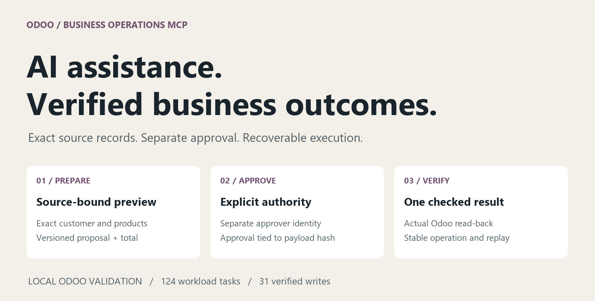

# Engineering case study

## Turning AI intent into a verified Odoo operation

Sales operations often needs a small but consequential action: find the correct
customer, prepare a quotation, or schedule a follow-up. A model can understand a
request while still selecting a same-name customer, inventing a quantity or
missing a changed price. A successful HTTP response also does not establish
that the resulting business record matches what was approved.

This project implements the full boundary between interpretation and action.
The assistant selects one typed skill. Deterministic services resolve source
records and build a preview. A separate actor approves the exact proposal.
Execution finishes only when the Odoo result has been checked.

## Architecture decisions

**A narrow MCP contract.** Eleven allowlisted tools expose useful business
capabilities rather than arbitrary Odoo model methods or SQL. The TypeScript
server authenticates the caller and forwards to a Python domain service;
permissions are enforced again at the service boundary.

**One rules implementation.** Four Python skills serve the assistant and the
persistent worker. Tenant configuration changes records and policy without
copying business logic. SQLite stores local orchestration state; PostgreSQL
and Odoo own the authoritative business transaction records.

**Approval binds to evidence.** A proposal contains the resolved customer,
items, pricing, source version and payload hash. Separate approval cannot be
reused for a modified payload. The Odoo addon checks source freshness inside
the write boundary, closing the race between a preview and execution.

**Unknown is a useful state.** A timeout can occur after Odoo commits. The
service keeps a durable operation ID and reconciles its ledger/result before
any retry. The local worker fences old lease owners and routes uncertain
preparation to review rather than replaying it automatically.

**Model flexibility without changing authority.** OpenAI and Ollama integration
paths share typed schemas, source resolution and approval rules. The small local
model remains experimental based on evaluation. Provider substitution does not
change who may authorize a write.

See the [current system architecture](../../README.md#architecture-and-authority)
for both browser and MCP paths through the shared domain service.

## What the evidence establishes

| Question | Observed result | Source |
| --- | --- | --- |
| Do authorization and recovery controls pass? | 98 offline, 41 PostgreSQL/Odoo and 14 live checks | [Control record](../evidence/phase8-controls.txt) |
| Does replay duplicate effects? | 31 workload writes each had one ledger entry and one order | [Load evidence](../evidence/phase8-load.json) |
| What is latency under the bounded workload? | Write p95 0.3875 / 0.4362 / 0.5216 s for normal / peak / short soak | [Workload definition and results](../PHASE-8.md) |
| Can the local system be recovered? | Isolated matching restore/read-back in 30.11 s; compatible rollback passed | [Recovery evidence](../evidence/phase8-recovery.json) |
| Can someone inspect an end-to-end example? | Nine recorded CLI stages, one actual Odoo draft | [Walkthrough](../demo/README.md) |
| Does the current MCP/browser handoff work? | Connected MCP preparation, browser approval, MCP execution/status/replay and one Odoo effect | [Phase 9B journey](../evidence/mcp-first-journey.md) |

Load uses synthetic records and real local HTTP/PostgreSQL/Odoo paths, with
model calls measured separately. The soak lasts about two minutes. Approval
uses separate automated test identities; human review time and customer ROI
were not measured. These finite results support local engineering readiness,
not unrestricted production or cloud-performance claims.

## Delivery and next deployment boundary

The release includes locked dependencies, versioned contracts, an operator
guide, a recovery runbook, a reproducible recording and tagged learning
checkpoints. The current browser handles independent review only; the MCP
client prepares and executes. A [connected synthetic journey](../evidence/mcp-first-journey.md)
shows both boundaries and the resulting Odoo draft. The full browser workspace
remains in the historical [Phase 9A checkpoint](../PHASE-9A.md). The CLI retains
the natural-language assistant and automation entry points.

Azure is a prepared deployment design. Its next gate includes infrastructure
as code, distinct credentials, restricted HTTPS access, private backups,
delivered human alerts and fresh cloud acceptance. No hosted URL or Azure
runtime evidence is implied by the local results.

[Operator guide](../USER-GUIDE.md) · [Release](../RELEASE.md) · [Azure design](../AZURE-PLAN.md)
